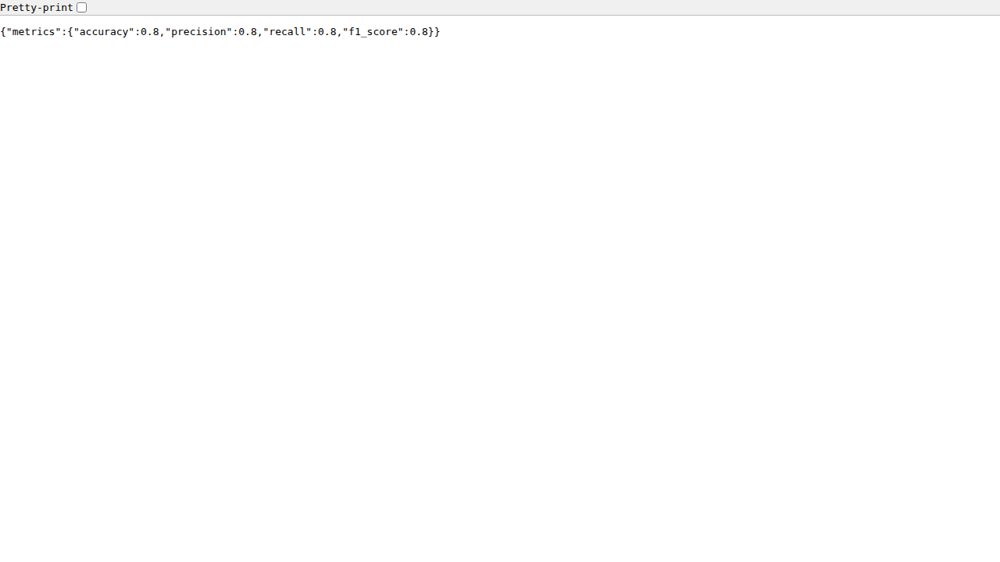

# AISE23-W9D2-Assignment-LizzieHoward

## ML Metrics API

A FastAPI application for serving machine learning model metrics with batch inference capabilities.

## Project Structure

```
├── app/
│   ├── __init__.py
│   ├── main.py          # FastAPI application
│   └── metrics.py       # Metrics calculation module
├── data/
│   ├── input.csv        # Sample input data
│   └── predictions.csv  # Sample output from batch script
├── models/
│   └── baseline.joblib  # Trained logistic regression model
├── batch_infer.py       # Batch inference script
├── requirements.txt     # Python dependencies
├── Dockerfile           # Docker configuration
├── README.md            # This file
└── screenshots/
    └── metrics.png      # Screenshot of /metrics endpoint response
```

## Setup

### Local Installation

1. Clone the repository:
```bash
git clone <repository-url>
cd AISE23-W9D2-Assignment-LizzieHoward
```

2. Create and activate a virtual environment (optional but recommended):
```bash
python -m venv venv
source venv/bin/activate  # On Windows: venv\Scripts\activate
```

3. Install dependencies:
```bash
pip install -r requirements.txt
```

### Docker Installation

Build and run using Docker:
```bash
docker build -t ml-metrics-api .
docker run -p 8000:8000 ml-metrics-api
```

## Usage

### Running the API

Start the FastAPI server:
```bash
uvicorn app.main:app --host 0.0.0.0 --port 8000
```

### API Endpoints

- **GET /** - Welcome message
- **GET /health** - Health check endpoint
- **GET /metrics** - Returns model performance metrics (accuracy, precision, recall, F1 score)

### Running Batch Inference

Run batch inference on input data:
```bash
python batch_infer.py --model models/baseline.joblib --input data/input.csv --output data/predictions.csv
```

#### Command Line Arguments

- `--model`: Path to the trained model file (default: `models/baseline.joblib`)
- `--input`: Path to the input CSV file (default: `data/input.csv`)
- `--output`: Path to save the output predictions (default: `data/predictions.csv`)
- `--label-column`: Name of the label column in input data (default: `label`)

## Screenshots

### Metrics Endpoint Response

